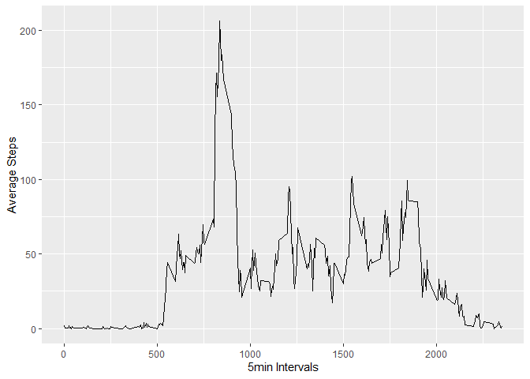

```r
library(knitr)
```

```
## Warning: package 'knitr' was built under R version 3.6.3
```

```r
opts_chunk$set(echo = TRUE)
options(digits=2)
```

## Loading and preprocessing the data

```r
fit_data <- read.csv("activity.csv")
fit_data$date <- as.Date(fit_data$date)
```


## What is mean total number of steps taken per day?

```r
library(dplyr)
```

```
## Warning: package 'dplyr' was built under R version 3.6.3
```

```
## 
## Attaching package: 'dplyr'
```

```
## The following objects are masked from 'package:stats':
## 
##     filter, lag
```

```
## The following objects are masked from 'package:base':
## 
##     intersect, setdiff, setequal, union
```

```r
library(ggplot2)
```

```
## Warning: package 'ggplot2' was built under R version 3.6.3
```

```r
steps_by_day <- fit_data %>% group_by(date) %>% summarise(Total_Steps = sum(steps))
qplot(steps_by_day$Total_Steps, 
      geom="histogram",
      main = "Distribution of Total Steps per Day", 
      xlab = "Total Steps per Day" )
```

```
## `stat_bin()` using `bins = 30`. Pick better value with `binwidth`.
```

```
## Warning: Removed 8 rows containing non-finite values (stat_bin).
```

<!-- -->

```r
mean_steps_by_day <- mean(steps_by_day$Total_Steps, na.rm = TRUE)
median_steps_by_day <- median(steps_by_day$Total_Steps, na.rm = TRUE)
```
Mean and median number of steps taken each day are (respectively): 1.08\times 10^{4} and  10765

## What is the average daily activity pattern?

```r
steps_by_interval <- fit_data %>% group_by(interval) %>% summarise(avg_steps = mean(steps, na.rm = TRUE))

ggplot(steps_by_interval, aes(interval, avg_steps)) + geom_line() + xlab("5min Intervals") + ylab("Average Steps")
```

<!-- -->

```r
max_avg_5 <- steps_by_interval %>% filter(avg_steps == max(steps_by_interval$avg_steps)) %>% select(interval)
```

5-minute interval, on average across all the days in the dataset, contains the maximum number of steps: 835

## Imputing missing values


```r
#Total of NAs
na_total <- sum(is.na(fit_data$steps))


#fill NA with mean of steps
new_fit_data <- fit_data
new_fit_data$steps[is.na(new_fit_data$steps)] <- as.integer(mean(fit_data$steps, na.rm = TRUE))

#Number of Steps each day
new_steps_by_day <- new_fit_data %>% group_by(date) %>% summarise(total_steps = sum(steps))

#histogram + mean + median

qplot(new_steps_by_day$total_steps, 
      geom="histogram",
      main = "Distribution of Total Steps per Day", 
      xlab = "Total Steps per Day" )
```

```
## `stat_bin()` using `bins = 30`. Pick better value with `binwidth`.
```

<!-- -->

```r
mean_new_steps_by_day <- mean(new_steps_by_day$total_steps)
median_new_steps_by_day <- median(new_steps_by_day$total_steps)
```

the New mean and median number of steps taken each day are (respectively): 1.08\times 10^{4} and  10656

## Are there differences in activity patterns between weekdays and weekends?


```r
# Add New colummn
new_fit_data <- new_fit_data %>% mutate(Weekday_or_weekend= ifelse(weekdays(new_fit_data $date)=="Saturday" | weekdays(new_fit_data $date)=="Sunday", "Weekend", "Weekday"))

new_steps_by_interval <- new_fit_data %>% group_by(Weekday_or_weekend, interval) %>% summarise(avg_steps = mean(steps, na.rm = TRUE))

#Plot 
ggplot(new_steps_by_interval, aes(interval, avg_steps)) + geom_line() + xlab("5min Intervals") + ylab("Average Steps") + facet_grid(Weekday_or_weekend~.)
```

<!-- -->
